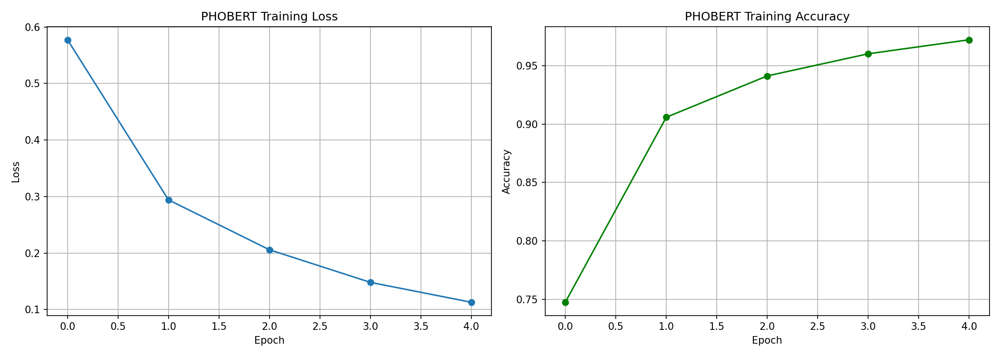
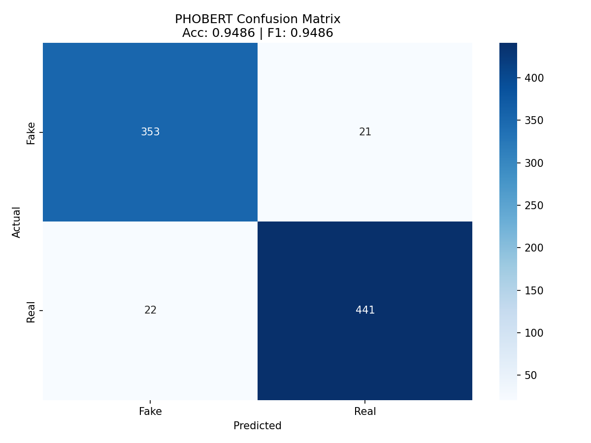
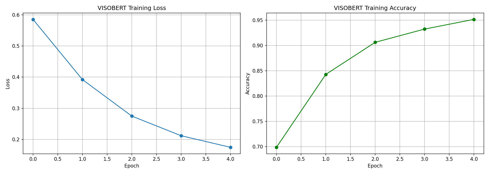
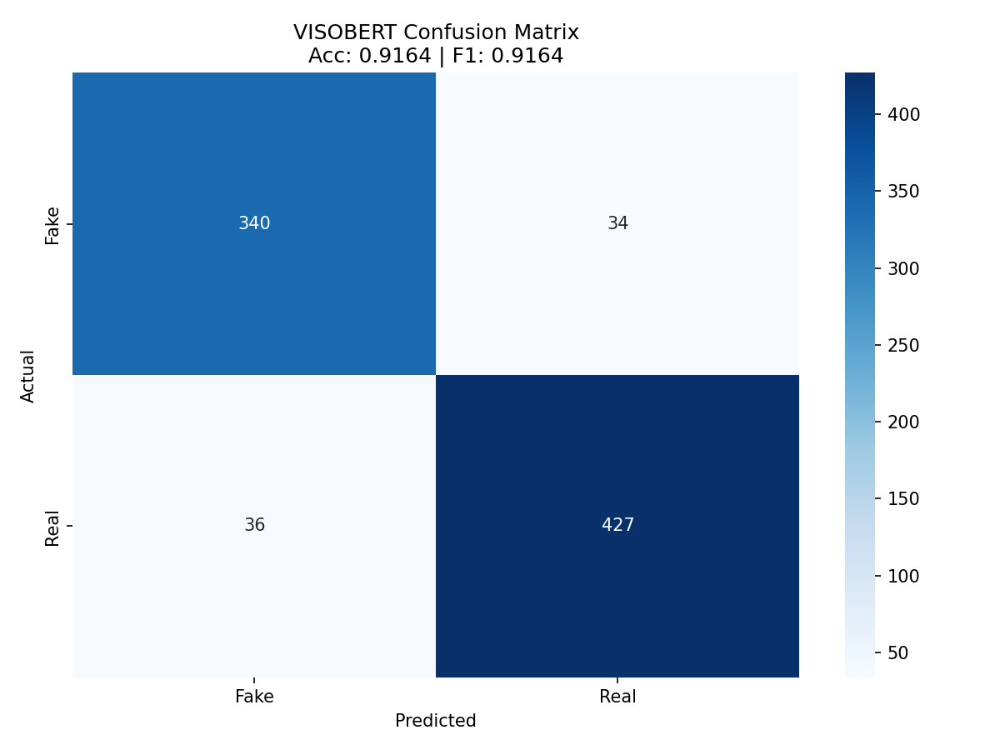

# Vietnamese Fake News Detection System

This repository contains code, datasets, and scripts developed for a study on Vietnamese Fake News Detection. The project implements a hybrid architecture that combines deep semantic representations from pre-trained language models, handcrafted stylistic features, and external verification evidence retrieved via a Retrieval-Augmented Generation (RAG) system. The final model runs as an ensemble of domain-specialized experts to classify Vietnamese news and social media texts.

---

## 1. Introduction and Objectives

Identifying misinformation in Vietnamese text presents unique challenges, including:
* **Informal Writing & Dialects**: Social media posts frequently contain abbreviation codes ("teencode"), spelling variations, and lack of diacritics.
* **Lack of Context**: Short articles or social media posts often require external factual evidence to verify their truthfulness.
* **Domain Discrepancy**: Formal news articles (from publishers) and social media posts (from platforms like Facebook) exhibit different linguistic properties.

To address these challenges, this project investigates:
1. **Hybrid Fusion**: Fusing transformer-based semantic embeddings (PhoBERT and ViSoBERT) with handcrafted linguistic features.
2. **Hybrid RAG Retriever**: Verifying claims by retrieving temporal and semantic evidence from an external knowledge base.
3. **Robust Data Augmentation**: Simulating social media noise during training to increase generalization on informal texts.
4. **Model Explainability**: Utilizing Integrated Gradients to trace predictions back to specific input words and style characteristics.

---

## 2. Dataset and Directory Structure

The study operates on two distinct data resources:
* **Task Dataset**: Located in the [Organized/](file:///d:/Work/Code/GithubProjects/FakeNewsDetection/Organized/) directory, containing labeled articles and social media claims categorized into:
  * [FAKE_Article.jsonl](file:///d:/Work/Code/GithubProjects/FakeNewsDetection/Organized/FAKE_Article.jsonl)
  * [FAKE_Social.jsonl](file:///d:/Work/Code/GithubProjects/FakeNewsDetection/Organized/FAKE_Social.jsonl)
  * [REAL_Article.jsonl](file:///d:/Work/Code/GithubProjects/FakeNewsDetection/Organized/REAL_Article.jsonl)
  * [REAL_Social.jsonl](file:///d:/Work/Code/GithubProjects/FakeNewsDetection/Organized/REAL_Social.jsonl)
* **External Knowledge Base**: Stored in the [KnowledgeBase/](file:///d:/Work/Code/GithubProjects/FakeNewsDetection/KnowledgeBase/) directory, specifically [KB35.jsonl](file:///d:/Work/Code/GithubProjects/FakeNewsDetection/KnowledgeBase/KB35.jsonl). It contains approximately 35,000 reference articles acting as the facts database.

### Repository Layout

```
├── .dockerignore                  # Excludes files from Docker build context
├── DatasetCode/                   # Data collection and organization tools
│   ├── organize.py                # Organizes raw JSON files by label & type
│   ├── scrapper.py                # Multi-site web scraper for news retrieval
│   └── other.py                   # Label mapping and data migration scripts
├── Organized/                     # Standardized JSONL datasets (REAL / FAKE)
├── KnowledgeBase/                 # External facts database
│   └── KB35.jsonl                 # 35K reference articles
├── scripts/                       # Pipelines for model training and preprocessing
│   ├── build_cache.py             # Pre-computes RAG and style features to speed up training
│   └── train_model.py             # Training loop for PhoBERT and ViSoBERT experts
├── src/                           # Model logic and feature extraction modules
│   ├── augmentations.py           # Text perturbation and feature dropouts
│   ├── CACHES/                    # Pre-computed RAG and training caches (git-ignored)
│   │   ├── caches.txt             # GDrive link to download caches
│   │   ├── DATASET_CACHE/         # Cached training datasets
│   │   └── KNOWLEDGE_BASE_CACHE/  # Cached FAISS + BM25 index objects
│   ├── checkpoints/               # Model weights and validation plots (git-ignored)
│   │   ├── models.txt             # GDrive link to download model checkpoints
│   │   ├── *_training_curves.png  # Training accuracy/loss graphs
│   │   └── *_confusion_matrix.png # Training confusion matrices
│   ├── dataset.py                 # PyTorch datasets (live & cached versions)
│   ├── features.py                # 10-dimensional style extractor
│   ├── inference/                 # Inference demo and validation assets
│   │   ├── inference.ipynb        # Jupyter notebook demo for inference and XAI
│   │   └── test_samples.jsonl     # 6-sample custom batch test dataset
│   ├── model.py                   # Hybrid model architecture and Ensemble wrapper
│   ├── preprocessing.py           # Text cleaners and teencode normalizer
│   ├── rag_utils.py               # Hybrid FAISS + BM25 RAG engine
│   └── xai_utils.py               # Captum-based Integrated Gradients explainability
├── data_collect.py                # Entry point for running web scrapers
├── dockerfile                     # Docker environment configuration
├── docker_requirements.txt        # Python packages for Docker environment
├── main.py                        # Command-line interface for inference
├── README.md                      # Study report document
├── requirements.txt               # Local python packages
├── run_linux_mac.sh               # Bash runner script for Linux/macOS
└── run_windows.bat                # Batch runner script for Windows
```

---

## 3. Methodology and System Architecture

The overall system architecture consists of a pipeline spanning text cleaning, retrieval verification, style extraction, neural embedding, and model fusion.

```
                                 ┌────────────────────────┐
                                 │     Raw Input Text     │
                                 └───────────┬────────────┘
                                             │
                                 ┌───────────▼────────────┐
                                 │    Preprocessing       │
                                 │ (Unicode, Teencode...) │
                                 └─────┬────────────┬─────┘
                                       │            │
                      ┌────────────────▼┐          ┌▼─────────────────┐
                      │  Style Feature  │          │    Hybrid RAG    │
                      │   Extraction    │          │  (FAISS + BM25)  │
                      └────────┬────────┘          └────────┬─────────┘
                               │                            │
                               │ (10-dim Style Vector)      │ (Retrieved Evidence)
                               │                            │
                               ├──────────────────────┐     │
                               │                      │     │
                               │              ┌───────▼─────▼───────┐
                               │              │  Capping & Pairing  │
                               │              └───────┬─────┬───────┘
                               │                      │     │
                               │        ┌─────────────┘     └─────────────┐
                               │        │ (Text + Evidence)               │ (Text + Evidence)
                               │  ┌─────▼───────────────┐           ┌─────▼───────────────┐
                               │  │ PhoBERT Tokenizer   │           │ ViSoBERT Tokenizer  │
                               │  └─────┬───────────────┘           └─────┬───────────────┘
                               │        │ (Token IDs A)                   │ (Token IDs B)
                               │  ┌─────▼───────────────┐           ┌─────▼───────────────┐
                               │  │ PhoBERT Encoder     │           │ ViSoBERT Encoder    │
                               │  │     (BERT A)        │           │     (BERT B)        │
                               │  └─────┬───────────────┘           └─────┬───────────────┘
                               │        │ (768-dim CLS A)                 │ (768-dim CLS B)
                               │        │                                 │
                               ├────────┼─────────────────────────────────┼──────────────┐
                               │        │                                 │              │
                             ┌─▼────────▼────────────┐                ┌───▼──────────────▼────┐
                             │  Concatenate Fusion   │                │  Concatenate Fusion   │
                             │    (768 + 10 = 778)   │                │    (768 + 10 = 778)   │
                             └──────────┬────────────┘                └──────────┬────────────┘
                                        │ (Fused Vector A)               │ (Fused Vector B)
                                 ┌──────▼────────────────┐        ┌──────▼────────────────┐
                                 │ PhoBERT Classifier    │        │ ViSoBERT Classifier   │
                                 │         (MLP)         │        │         (MLP)         │
                                 └──────┬────────────────┘        └──────┬────────────────┘
                                        │ (Logits A)                     │ (Logits B)
                                 ┌──────▼────────────────┐        ┌──────▼────────────────┐
                                 │      Softmax A        │        │      Softmax B        │
                                 └──────┬────────────────┘        └──────┬────────────────┘
                                        │ (Probabilities A)              │ (Probabilities B)
                                        └─────────────┐     ┌────────────┘
                                                      │     │
                                                   ┌──▼─────▼──┐
                                                   │Soft Voting│ (Average Probabilities)
                                                   └─────┬─────┘
                                                         │
                                               ┌─────────▼─────────┐
                                               │ Final Prediction  │ (FAKE/REAL & Confidence)
                                               └───────────────────┘
```

### 3.1. Text Preprocessing (`src/preprocessing.py`)
To map highly irregular online texts to structured tokens, the [preprocessing.py](file:///d:/Work/Code/GithubProjects/FakeNewsDetection/src/preprocessing.py) module performs the following operations:
1. **Unicode Standardization**: Normalizes characters to Unicode `NFC` form, resolving compounding mark problems.
2. **HTML Cleanup**: Decodes HTML entities (e.g., `&amp;` -> `&`) and strips residual tag syntaxes.
3. **Irrelevant Pattern Stripping**: Removes URLs, email addresses, and zero-width spaces/NBSPs.
4. **Repetition Collapsing**: Detects and reduces stretched vowels/consonants often found in sensational writing (e.g., `"đẹpppp"` -> `"đẹp"`).
5. **Teencode Normalizer**: Translates informal abbreviations and internet slang into formal Vietnamese words (e.g., `"ko"` -> `"không"`, `"dc"` -> `"được"`, `"mn"` -> `"mọi người"`) based on a lookup dictionary [TEENCODE_DICT](file:///d:/Work/Code/GithubProjects/FakeNewsDetection/src/preprocessing.py#L5).

### 3.2. Hybrid RAG Retrieval Engine (`src/rag_utils.py`)
Factual verification uses a hybrid retrieval pipeline in [rag_utils.py](file:///d:/Work/Code/GithubProjects/FakeNewsDetection/src/rag_utils.py) to extract the most relevant passage from the external database:
1. **Dense Retrieval**: Embeds the preprocessed query text using a sentence transformer model (`sentence-transformers/all-MiniLM-L6-v2`) and performs a fast similarity search on a pre-trained [FAISS](file:///d:/Work/Code/GithubProjects/FakeNewsDetection/src/rag_utils.py#L10) index. This filters the 35,000 corpus documents down to the top $K=1000$ candidates.
2. **Sparse Reranking**: Evaluates the candidates using BM25L (`rank_bm25` library) to calculate exact keyword overlaps, yielding a more precise relevance ranking.
3. **Temporal Filtering**: The system extracts dates (e.g., matching formats like `dd/mm/yyyy`, `yyyy`, or written Vietnamese dates like `"ngày 15 tháng 10 năm 2023"`) from both the query claim and the retrieved document. If the document's date is older than the query claim by more than 3 years, the retrieved evidence is discarded to prevent stale historical facts from distorting the evaluation.
4. **Metrics Returned**: The retrieval yields:
   * The text of the retrieved document.
   * A BM25 confidence score (ratio of the candidate's BM25 score to the maximum possible score).
   * The mean IDF score of the query terms, indicating vocabulary specificity.

### 3.3. Handcrafted Style Feature Engineering ([features.py](file:///d:/Work/Code/GithubProjects/FakeNewsDetection/src/features.py))

A key focus of this study is the extraction of a 10-dimensional stylistic feature vector. Designed and engineered independently from first principles for the Vietnamese language context, this module operates under the hypothesis that **the manner in which a claim is written (its stylistic signature) is highly correlated with its credibility**, independent of its semantic content.

While neural models (such as BERT) extract dense semantic patterns, they are prone to overfitting to specific topic vocabularies. The handcrafted stylistic features designed in this study capture structural and emotional indicators of misinformation. All features are calculated within the [TextStyleExtractor](file:///d:/Work/Code/GithubProjects/FakeNewsDetection/src/features.py#L71) class and stochastically normalized to the $[0, 1]$ interval to allow stable vector concatenation with BERT embedding tensors.

The 10 dimensions of the handcrafted style vector are defined below:

#### 1. Emotion Intensity Score (`emotion_intensity`)
* **Rationale**: Fake news and misleading rumors in Vietnamese frequently employ high-intensity emotional triggers (inducing fear, anger, outrage) or express miraculous cures to drive virality.
* **Calculation**: Counts occurrences of words in a compiled dictionary of high-intensity emotional markers (such as `"sốc"`, `"kinh hoàng"`, `"phẫn nộ"`, `"lừa đảo"`, `"thần kỳ"`, `"cam kết"`). The raw frequency ratio is normalized using a soft-saturation curve:
  $$f_{\text{emotion}} = \frac{C_{\text{emotion}}}{N_{\text{words}}}$$
  $$S_{\text{emotion}} = \frac{f_{\text{emotion}}}{f_{\text{emotion}} + \alpha_{\text{emotion}}}$$
  where $C_{\text{emotion}}$ is the count of emotional words, $N_{\text{words}}$ is the total token count, and $\alpha_{\text{emotion}} = 0.3$ is a tuning factor that controls the steepness of the saturation response.

#### 2. Subjectivity Proxy Score (`subjectivity_score`)
* **Rationale**: Factual reports tend to present assertions objectively, whereas misinformation and personal opinions often embed markers of speculation, hearsay, or unverified claims.
* **Calculation**: Looks up matches in a dictionary of Vietnamese subjective markers (including speculation/uncertainty indicators like `"hình như"`, `"có vẻ"`, `"nghe đồn"`, first-person opinion markers like `"theo tôi"`, `"tôi nghĩ"`, and unbacked certainty exaggerations like `"chắc chắn"`, `"không thể phủ nhận"`). It utilizes the same soft-saturation formula:
  $$f_{\text{subj}} = \frac{C_{\text{subj}}}{N_{\text{words}}}$$
  $$S_{\text{subj}} = \frac{f_{\text{subj}}}{f_{\text{subj}} + \alpha_{\text{subj}}}$$
  with $\alpha_{\text{subj}} = 0.3$.

#### 3. Log-Normalized Word Count (`word_count_normalized`)
* **Rationale**: Fake news posts—particularly on social platforms—are often short, punchy claims, whereas genuine reporting tends to offer more comprehensive explanations and background details.
* **Calculation**: Normalizes the raw word count logarithmically against a standard text baseline threshold of $512$ words to prevent large outliers from distorting neural weights:
  $$S_{\text{length}} = \text{clip}\left(\frac{\ln(1 + N_{\text{words}})}{\ln(1 + 512)}, 0, 1\right)$$

#### 4. Lexical Diversity Score (`lexical_diversity`)
* **Rationale**: Repetitive phrasing or simple, redundant vocabulary is often characteristic of spam, low-effort sensationalism, or emotionally driven narratives. High lexical diversity indicates a wider, more structured vocabulary.
* **Calculation**: Formulated as the ratio of unique tokens to total tokens, scaled logarithmically to minimize sequence-length bias:
  $$S_{\text{lex-div}} = \frac{\ln(1 + U_{\text{words}})}{\ln(1 + N_{\text{words}})}$$
  where $U_{\text{words}}$ is the count of unique words.

#### 5. Word Rarity / Mean Inverse Document Frequency (`mean_idf`)
* **Rationale**: Genuine articles discussing specific news events utilize specialized, informative keywords (e.g., proper nouns, technical terms) that have high IDF scores. Misinformation often relies on generic, broad vocabulary with low IDF scores.
* **Calculation**: For all tokenized terms in the query text that exist in the RAG corpus vocabulary, the system extracts their IDF values, computes the average, and scales it by the maximum IDF in the corpus:
  $$S_{\text{mean-idf}} = \text{clip}\left(\frac{\frac{1}{|T|} \sum_{t \in T} \text{IDF}(t)}{\text{IDF}_{\text{max}}}, 0, 1\right)$$

#### 6. Capitalization Ratio (`caps_ratio`)
* **Rationale**: Excessive capitalization (e.g., writing entire words or sentences in uppercase) acts as a visual shouting mechanism, which is prevalent in sensational headlines and clickbait social posts.
* **Calculation**: The ratio of uppercase alphabetic characters to total alphabetic characters in the original text:
  $$S_{\text{caps}} = \frac{N_{\text{upper}}}{N_{\text{total}}}$$

#### 7. Sensational Punctuation Ratio (`punctuation_ratio`)
* **Rationale**: Exclamation points (`!`) and question marks (`?`) are frequently stacked in clickbait text to manufacture urgency or doubt. Official news releases avoid these markers.
* **Calculation**: The density of `!` and `?` characters in the text, normalized relative to the word count:
  $$f_{\text{punct}} = \frac{N_{\text{excl}} + N_{\text{quest}}}{N_{\text{words}}}$$
  $$S_{\text{punct}} = \frac{f_{\text{punct}}}{f_{\text{punct}} + \alpha_{\text{punct}}}$$
  with $\alpha_{\text{punct}} = 0.7$.

#### 8. Personal Pronoun Density (`pronoun_density`)
* **Rationale**: Direct personal pronouns (e.g., `"tao"`, `"mày"`, `"tớ"`, `"ní"`, `"bọn anh"`) imply informal, chatty, or conversational contexts, which are typical of social media rumors. Formal news reports strictly use objective, third-person referencing.
* **Calculation**: Calculates matches of single pronouns ($W_{\text{single}} = 1.0$) and collective pronouns ($W_{\text{collective}} = 1.5$) to reflect the higher contrast collective pronouns provide. The sum is divided by the word count and saturated:
  $$C_{\text{pronouns}} = \sum_{w \in T} W(w)$$
  $$f_{\text{pronouns}} = \frac{C_{\text{pronouns}}}{N_{\text{words}}}$$
  $$S_{\text{pronouns}} = \frac{f_{\text{pronouns}}}{f_{\text{pronouns}} + \alpha_{\text{pronouns}}}$$
  with $\alpha_{\text{pronouns}} = 0.7$.

#### 9. Typo and Slang Density (`typo_slang_density`)
* **Rationale**: Hasty writing, non-standard spelling abbreviations, and teencode conventions (e.g., `"ko"`, `"dc"`, `"j"`, `"zậy"`) are direct indicators of social media origins and lack of editorial standards.
* **Calculation**: The proportion of words matching the informal Vietnamese teencode dictionary, saturated with a high sensitivity factor ($\alpha_{\text{slang}} = 0.1$):
  $$f_{\text{slang}} = \frac{C_{\text{slang}}}{N_{\text{words}}}$$
  $$S_{\text{slang}} = \frac{f_{\text{slang}}}{f_{\text{slang}} + \alpha_{\text{slang}}}$$

#### 10. RAG Evidence Confidence Score (`bm25_score`)
* **Rationale**: If a search query based on the claim yields a highly relevant document in our curated database of verified news (yielding a high BM25 match score), the claim is highly likely to be real. Conversely, a lack of matching verified records (score of 0.0) indicates a high probability of a rumor or unverified claim.
* **Calculation**: Obtained directly from the hybrid RAG retrieval engine, representing the normalized score of the best-matching document:
  $$S_{\text{bm25}} = \text{clip}\left(\frac{\text{BM25Score}}{\text{MaxPossibleScore}}, 0, 1\right)$$

### Summary of Feature Significance

The resulting 10-dimensional vector:
```math
\mathbf{v}_{\text{style}} = \begin{bmatrix} S_{\text{emotion}} & S_{\text{subj}} & S_{\text{length}} & S_{\text{lex-div}} & S_{\text{mean-idf}} & S_{\text{caps}} & S_{\text{punct}} & S_{\text{pronouns}} & S_{\text{slang}} & S_{\text{bm25}} \end{bmatrix}^T
```
provides a domain-agnostic linguistic footprint. Combined with the semantic vector, it aids the downstream classifier in distinguishing between formal journalism, unverified rumors, and emotional clickbait.


### 3.4. Model Architecture & Fusion Classifier (`src/model.py`)
The [HybridModel](file:///d:/Work/Code/GithubProjects/FakeNewsDetection/src/model.py#L11) fuses deep semantic representations with handcrafted style features:
* **Semantic Encoding**: The preprocessed input text and the RAG evidence are concatenated as a sentence pair (separated by special boundary tokens) and passed into a pre-trained transformer model (such as PhoBERT or ViSoBERT). The embedding from the first token (`[CLS]`) is extracted, yielding a 768-dimensional semantic vector.
* **Linguistic Concatenation**: The 768-dimensional BERT embedding and the 10-dimensional style vector are concatenated to form a 778-dimensional joint representation.
* **Classifier MLP**: The joint vector passes through a Multi-Layer Perceptron (MLP) consisting of:
  * Dense Layer (778 $\to$ 256) $\to$ ReLU $\to$ Dropout ($p=0.3$)
  * Dense Layer (256 $\to$ 128) $\to$ ReLU $\to$ Dropout ($p=0.3$)
  * Dense Layer (128 $\to$ 2) producing classification logits (FAKE / REAL).

### 3.5. Dual-Expert Ensemble Wrapper (`src/model.py`)
Because online misinformation spans multiple registers (ranging from formal fake press releases to informal social network posts), the system leverages a soft-voting ensemble:
1. **PhoBERT Expert**: Trained with the `vinai/phobert-base-v2` tokenizer and backbone. It is highly optimized for grammatically standard Vietnamese articles.
2. **ViSoBERT Expert**: Trained with the `uitnlp/visobert` tokenizer and backbone. It is specialized for informal social media structures.
3. **Voting Process**: During evaluation, the [EnsembleWrapper](file:///d:/Work/Code/GithubProjects/FakeNewsDetection/src/model.py#L85) tokenizes input text independently for both architectures using their respective vocabularies. It runs forward passes through both experts, averages the final probability distributions (soft voting), and predicts the class with the highest probability.

---

## 4. Robust Data Augmentation (`src/augmentations.py`)

To ensure the models generalize well to informal environments and are robust to retrieval failures, the [TextAugmentations](file:///d:/Work/Code/GithubProjects/FakeNewsDetection/src/augmentations.py#L97) class applies stochastic transformations during training:
* **Teencode Injection ($P=0.3$)**: Randomly replaces standard Vietnamese words with social media variants (e.g., converting `"không"` back into `"ko"`, `"hông"`, or `"kh"`).
* **Accent Diacritics Drop ($P=0.2$)**: Replaces accented vowels with their non-accented Latin equivalents (e.g., `"việt nam"` $\to$ `"viet nam"`), simulating mobile keyboard typing without Vietnamese IME.
* **Casing Noise ($P=0.15$)**: Randomly transforms words into lowercase, UPPERCASE, or Title Case to simulate formatting inconsistencies.
* **Punctuation Distortions ($P=0.2$)**: Randomly adds exclamation/question marks to ends of words or simplifies multiple repeated punctuations (e.g., `"!!!"` $\to$ `"!""`).
* **Gap Padding ($P=0.1$)**: Injects random duplicate whitespace gaps.
* **Style Vector & RAG Dropout ($P=0.1$)**: Masking random elements of the style vector or setting the BM25 confidence to $0$ stochastically. This forces the neural layers to handle instances where external evidence is unavailable or the style extractor experiences failure.

---

## 5. Explainable AI Utilities (`src/xai_utils.py`)

To provide model transparency, the system implements attribution tracking:
1. **Token Attribution (Integrated Gradients)**: Using Captum's [LayerIntegratedGradients](file:///d:/Work/Code/GithubProjects/FakeNewsDetection/src/xai_utils.py#L66), the system computes the path integrals of gradients from a baseline input (all padding tokens) to the original input text. This yields an attribution score for each word token, showing whether it contributed positively (supports classification) or negatively (opposes classification) to the decision.
2. **Style Feature Sensitivity**: Computes the gradient of the predicted logit with respect to the input [style_vector](file:///d:/Work/Code/GithubProjects/FakeNewsDetection/src/xai_utils.py#L217). The absolute values of these gradients indicate the sensitivity of the model to individual features like capitalization, slang density, or punctuation.

---

## 6. Execution and Verification

### 6.1. Rebuilding Cache
Before training, the dataset must be preprocessed and cached to avoid redundant RAG searches and style computations on every epoch:
```bash
python scripts/build_cache.py
```
This script reads the files in the [Organized/](file:///d:/Work/Code/GithubProjects/FakeNewsDetection/Organized/) directory, queries the RAG indices, extracts features, and outputs a single serialized pickle file: `src/cache_dataset.pkl`.

### 6.2. Training the Experts
To train the neural backbones, use the unified script:
* **Train PhoBERT only**:
  ```bash
  python scripts/train_model.py phobert
  ```
* **Train ViSoBERT only**:
  ```bash
  python scripts/train_model.py visobert
  ```
* **Train both experts sequentially**:
  ```bash
  python scripts/train_model.py all
  ```

Training outputs checkpoints (`checkpoints/phobert_best.pth`, `checkpoints/visobert_best.pth`), training curves (`checkpoints/*_training_curves.png`), and confusion matrices (`checkpoints/*_confusion_matrix.png`).

### 6.3. Inference Command-Line Interface
The trained models can be tested using the [main.py](file:///d:/Work/Code/GithubProjects/FakeNewsDetection/main.py) script:
* **Single Text Inference**:
  ```bash
  python main.py --text "Cảnh báo khẩn cấp: dịch bệnh lạ bùng phát làm hàng nghìn người tử vong tại Hà Nội..."
  ```
* **File Input**:
  ```bash
  python main.py --file path/to/article.txt
  ```
* **Interactive Shell**:
  ```bash
  python main.py --interactive
  ```

### 6.4. Jupyter Notebook Inference & Explainable AI Demo
A fully documented, interactive demonstration is available in the [inference.ipynb](file:///d:/Work/Code/GithubProjects/FakeNewsDetection/src/inference/inference.ipynb) notebook. 

This notebook allows you to:
1. Load the dual-model ensemble with FP16 memory optimization.
2. Query claims and retrieve RAG evidence with caps and temporal filtering.
3. Classify claims and inspect individual model predictions.
4. Visualize token importance attributions using Integrated Gradients (Captum).
5. Run batch testing on the custom [test_samples.jsonl](file:///d:/Work/Code/GithubProjects/FakeNewsDetection/src/inference/test_samples.jsonl) dataset.

### 6.5. Containerized Inference (Docker)
You can build the Docker image and run the inference CLI inside a container using the provided wrapper scripts:

* **Windows**:
  Run [run_windows.bat](file:///d:/Work/Code/GithubProjects/FakeNewsDetection/run_windows.bat):
  ```cmd
  run_windows.bat
  ```
* **Linux / macOS**:
  Make the script executable and run [run_linux_mac.sh](file:///d:/Work/Code/GithubProjects/FakeNewsDetection/run_linux_mac.sh):
  ```bash
  chmod +x run_linux_mac.sh
  ./run_linux_mac.sh
  ```

Both scripts will automatically:
1. Build the Docker image `viet-fake-news-detector`.
2. Launch the container in interactive CLI mode (`--interactive`).
3. Mount local directories (`src/checkpoints/`, `KnowledgeBase/`, `src/CACHES/`) as persistent volumes so checkpoints and database files are shared between the host and container.
4. Attempt to run with GPU acceleration (`--gpus all`) and fallback to CPU mode automatically if the NVIDIA container runtime toolkit is missing.

---

## 7. Model Performance and Evaluation

### 7.1. Training & Validation Performance
The PhoBERT and ViSoBERT experts were trained for 5 epochs on standard splits of 4,742 training samples and 837 validation samples. The training logs ([phobert_training_log.txt](file:///d:/Work/Code/GithubProjects/FakeNewsDetection/src/checkpoints/phobert_training_log.txt) and [visobert_training_log.txt](file:///d:/Work/Code/GithubProjects/FakeNewsDetection/src/checkpoints/visobert_training_log.txt)) record the progress and final metrics:

| Metric | PhoBERT Expert (`vinai/phobert-base-v2`) | ViSoBERT Expert (`uitnlp/visobert`) |
| :--- | :---: | :---: |
| **Max Sequence Length** | 256 | 512 |
| **Final Train Loss** | 0.1129 | 0.1745 |
| **Final Train Accuracy** | 97.24% | 95.15% |
| **Val Loss** | 0.1938 | 0.2962 |
| **Val Accuracy** | **94.86%** | **91.64%** |
| **Val F1-Score** | **0.9486** | **91.64%** |
| **Val Precision** | 0.9486 | 0.9164 |
| **Val Recall** | 0.9486 | 0.9164 |

#### Detailed Validation Classification Reports

**PhoBERT Expert:**
```text
              precision    recall  f1-score   support

        Fake       0.94      0.94      0.94       374
        Real       0.95      0.95      0.95       463

    accuracy                           0.95       837
   macro avg       0.95      0.95      0.95       837
weighted avg       0.95      0.95      0.95       837
```

**ViSoBERT Expert:**
```text
              precision    recall  f1-score   support

        Fake       0.90      0.91      0.91       374
        Real       0.93      0.92      0.92       463

    accuracy                           0.92       837
   macro avg       0.92      0.92      0.92       837
weighted avg       0.92      0.92      0.92       837
```

### 7.2. Training Visualizations

#### PhoBERT Training Curves and Confusion Matrix
| Training Curves | Confusion Matrix |
| :---: | :---: |
|  |  |

#### ViSoBERT Training Curves and Confusion Matrix
| Training Curves | Confusion Matrix |
| :---: | :---: |
|  |  |

### 7.3. Batch Testing & Inference Validation
An end-to-end batch test validation was performed on the custom test set [test_samples.jsonl](file:///d:/Work/Code/GithubProjects/FakeNewsDetection/src/inference/test_samples.jsonl) containing 6 representative Vietnamese news and social media claims:

* **Batch Test Setup**: Tested using the soft-voting ensemble configuration (joint PhoBERT and ViSoBERT experts).
* **Test Dataset Composition**:
  * 4 samples from the verified datasets (`FAKE_Social`, `REAL_Social`, `FAKE_Article`, `REAL_Article`).
  * 2 newly authored custom samples (1 sensationalized fake social post, 1 official real news article).
* **Performance Results**:
  * **Total Samples**: 6
  * **Correct Predictions**: 6
  * **Validation Accuracy**: **100.00%**
  * **Detailed Predictions**:
    * `VT_Social_FAKE_36` (True: FAKE) $\to$ Predicted: **FAKE** (✓ Correct, Confidence: 92.68%)
    * `Social_REAL_6` (True: REAL) $\to$ Predicted: **REAL** (✓ Correct, Confidence: 98.93%)
    * `VTTS_Article_FAKE_4` (True: FAKE) $\to$ Predicted: **FAKE** (✓ Correct, Confidence: 98.88%)
    * `Article_REAL_13` (True: REAL) $\to$ Predicted: **REAL** (✓ Correct, Confidence: 99.02%)
    * `Custom_Social_FAKE_1` (True: FAKE) $\to$ Predicted: **FAKE** (✓ Correct, Confidence: 98.83%)
    * `Custom_Article_REAL_1` (True: REAL) $\to$ Predicted: **REAL** (✓ Correct, Confidence: 81.20%)

---

## 8. Preliminary Findings and Observations

During development and evaluation, several patterns were observed:
* **Domain Alignment**: PhoBERT exhibits strong precision on news articles but drops in accuracy on unstructured social posts. Conversely, ViSoBERT captures social media conventions (abbreviations, slang) effectively but struggles with complex, long-form syntax. The ensemble wrapper offsets these individual deficits via probability averaging.
* **Evidence Capping**: When concatenating retrieved RAG evidence, capping its token length to $150$ is critical. Unrestricted retrieval outputs are often long, causing the BERT self-attention mechanism to focus excessively on the evidence vocabulary (which is mostly real news) while masking out the stylistic signals (caps, teencode, extreme punctuation) of the input query.
* **Online Augmentation Utility**: Training without teencode injection and accent dropping results in high validation performance on cleaned datasets, but leads to severe degradation when testing on raw web inputs. Stochastic perturbations successfully bridge this domain gap.

---

## 9. References

### 9.1. Datasets and Knowledge Bases
1. **Vietnamese Online News Dataset (Knowledge Base)**: [Kaggle Dataset](https://www.kaggle.com/datasets/haitranquangofficial/vietnamese-online-news-dataset) containing ~35K online articles serving as our facts database.
2. **VFND (Vietnamese Fake News Dataset)**: [GitHub Repository](https://github.com/WhySchools/VFND-vietnamese-fake-news-datasets) containing benchmark claims and social media data.
3. **FakeNewVN Dataset**: [Kaggle Dataset](https://www.kaggle.com/datasets/chuynvinquc/fakenewvn/data) containing labeled Vietnamese news samples.

### 9.2. Pre-trained Language Models
4. **PhoBERT**: Nguyen, D. Q., & Tuan Nguyen, A. (2020). *PhoBERT: Pre-trained language models for Vietnamese*. Findings of the Association for Computational Linguistics: EMNLP 2020. [GitHub Research](https://github.com/VinAIResearch/PhoBERT).
5. **ViSoBERT**: Nguyen, P. Q. V., et al. (2023). *ViSoBERT: A Pre-trained Language Model for Vietnamese Social Media Text*. Association for Computational Linguistics. [GitHub Research](https://github.com/uitnlp/visobert).

### 9.3. Methodological Libraries & Frameworks
6. **Captum Model Interpretability**: PyTorch library for explainable AI (Integrated Gradients attribution). [Captum Official](https://captum.ai/).
7. **FAISS (Facebook AI Similarity Search)**: Douze, M., et al. (2024). *The FAISS Library for Vector Similarity Search*. [FAISS GitHub](https://github.com/facebookresearch/faiss).
8. **Rank-BM25 (BM25L)**: Python implementation of the BM25 reranking algorithms. [Rank-BM25 GitHub](https://github.com/dorianbrown/rank_bm25).